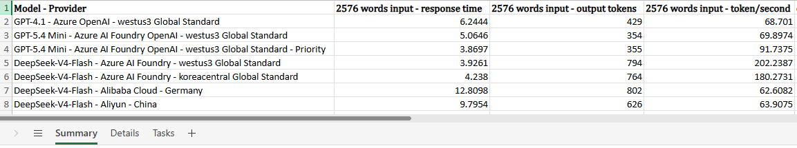
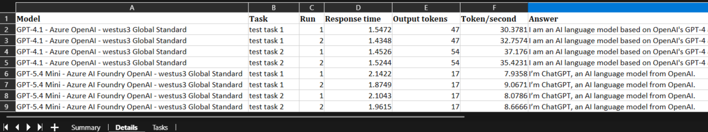
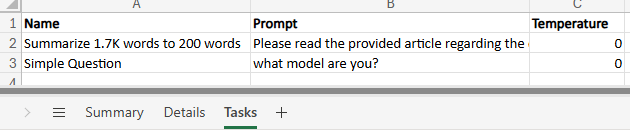
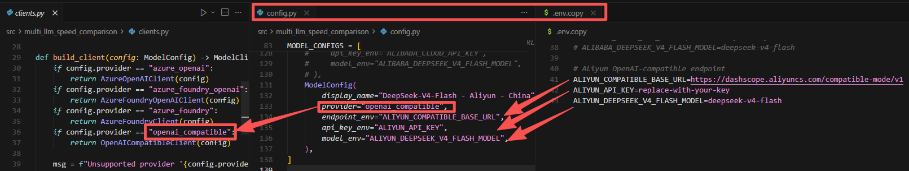

# multi-llm-speed-comparison

`multi-llm-speed-comparison` is a tool for evaluating the response speed of multiple LLMs.  
You can use it for multiple purposes, for example, to evaluate the LLM response time of the same model across different providers, or the LLM result of the same question across different LLMs.  
This Excel file is an output example: [llm_evaluation_output_example.xlsx](llm_evaluation_output_example.xlsx)


  

## 1. Setup

1. Install dependencies with `uv`:

```shell
uv sync
```
2. Copy the `.env.copy` file to `.env`. :  
Then, update the file with your actual endpoint URL, API key, and model name.
3. Add a new LLM:  
Add a new `ModelConfig` to the `MODEL_CONFIGS`. Below is an example of adding a LLM with an OpenAI-compatible API.
  

## 2. Run

Run the benchmark and write an Excel file under `outputs/`:

```shell
uv run multi-llm-speed-comparison
```

Use a custom Excel output path:

```shell
uv run multi-llm-speed-comparison --output outputs/my_result.xlsx
```

The module entry point also works:

```shell
uv run python -m multi_llm_speed_comparison
```

## 3. Customization Details
### Configure Benchmark Inputs

Edit [src/multi_llm_speed_comparison/config.py](src/multi_llm_speed_comparison/config.py).

The main values are near the top of the file:

- `RUNS_PER_MODEL`: how many calls to make for each model/task pair before averaging.
- `TEMPERATURE`: sampling temperature used for all model calls. The default is `0`.
- `BENCHMARK_TASKS`: named prompt tasks.
- `MODEL_CONFIGS`: the models to benchmark and the environment variables they use.

Example task addition:

```python
BENCHMARK_TASKS = [
    BenchmarkTask(name="10k input", prompt="paste roughly 10k tokens here"),
    BenchmarkTask(name="50k input", prompt="paste roughly 50k tokens here"),
]
```

### Extending Providers

The provider design is split into configuration and request clients:

- Add a model row in `MODEL_CONFIGS` when the new model uses an existing request style.
- Add a new client class in `src/multi_llm_speed_comparison/clients.py` when the platform has a different URL shape, authentication method, request body, or response body.
- Register the new provider string in `build_client()`.
- Add matching placeholder variables to `.env.copy`.

This keeps provider-specific request code isolated while the benchmark runner and Excel writer stay unchanged.

Current provider strings:

- `azure_openai`: Azure OpenAI chat completions deployment URL.
- `azure_foundry`: Azure AI Foundry chat completions URL.
- `azure_foundry_openai`: Azure AI Foundry OpenAI Responses API URL.
- `openai_compatible`: OpenAI-compatible chat completions URL.
