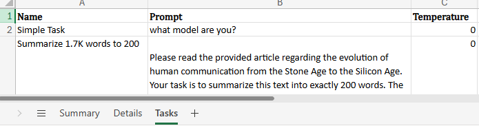

# multi-llm-speed-comparison

`multi-llm-speed-comparison` evaluates response speed for multiple LLM models across providers. 


  
This Excel file is an output example: [llm_evaluation_output_example.xlsx](llm_evaluation_output_example.xlsx)
## 1. Setup

1. Install dependencies with `uv`:

```shell
uv sync
```
2. Copy the `.env.copy` file to `.env`. :  
Then edit `.env`  with your real endpoint, API version, key, and model name.
3. How to add a new Model:  

  

## 2. Run

Run the benchmark and write an Excel file under `outputs/`:

```shell
uv run multi-llm-speed-comparison
```

Use a custom Excel output path:

```shell
uv run multi-llm-speed-comparison --output outputs/my_result.xlsx
```

The module entry point also works:

```shell
uv run python -m multi_llm_speed_comparison
```

## 3. Customization Details
### Configure Benchmark Inputs

Edit `src/multi_llm_speed_comparison/config.py`.

The main values are near the top of the file:

- `RUNS_PER_MODEL`: how many calls to make for each model/task pair before averaging.
- `TEMPERATURE`: sampling temperature used for all model calls. The default is `0`.
- `BENCHMARK_TASKS`: named prompt tasks, such as `0.01k`, `1k`, or `2k`.
- `MODEL_CONFIGS`: the models to benchmark and the environment variables they use.

Example task addition:

```python
BENCHMARK_TASKS = [
    BenchmarkTask(name="1k input", prompt="paste roughly 1k tokens here"),
    BenchmarkTask(name="5k input", prompt="paste roughly 5k tokens here"),
]
```

### Output Format

The Excel workbook has `Summary`, `Details`, and `Tasks` sheets.

The `Summary` sheet has the model name in the first column. Each benchmark task adds three columns:

- `<task name> - response time`
- `<task name> - output tokens`
- `<task name> - token/second`

For example, tasks named `1k` and `2k` produce columns like `1k - response time`, `1k - output tokens`, `1k - token/second`, `2k - response time`, `2k - output tokens`, and `2k - token/second`.

The `Details` sheet records each individual call with model name, task name, run number, response time, output token count, token/second, full answer text, and error message if the call failed.

The `Tasks` sheet records the configured benchmark task name, original prompt, and temperature.

### Extending Providers

The provider design is split into configuration and request clients:

- Add a model row in `MODEL_CONFIGS` when the new model uses an existing request style.
- Add a new client class in `src/multi_llm_speed_comparison/clients.py` when the platform has a different URL shape, authentication method, request body, or response body.
- Register the new provider string in `build_client()`.
- Add matching placeholder variables to `.env.copy`.
- Update this README and `AGENTS.md` whenever the architecture or startup steps change.

This keeps provider-specific request code isolated while the benchmark runner and Excel writer stay unchanged.

Current provider strings:

- `azure_openai`: Azure OpenAI chat completions deployment URL.
- `azure_foundry`: Azure AI Foundry chat completions URL.
- `azure_foundry_openai`: Azure AI Foundry OpenAI Responses API URL, currently used by GPT-5.4 Mini.
- `openai_compatible`: OpenAI-compatible chat completions URL, currently used by Alibaba Cloud DashScope.
